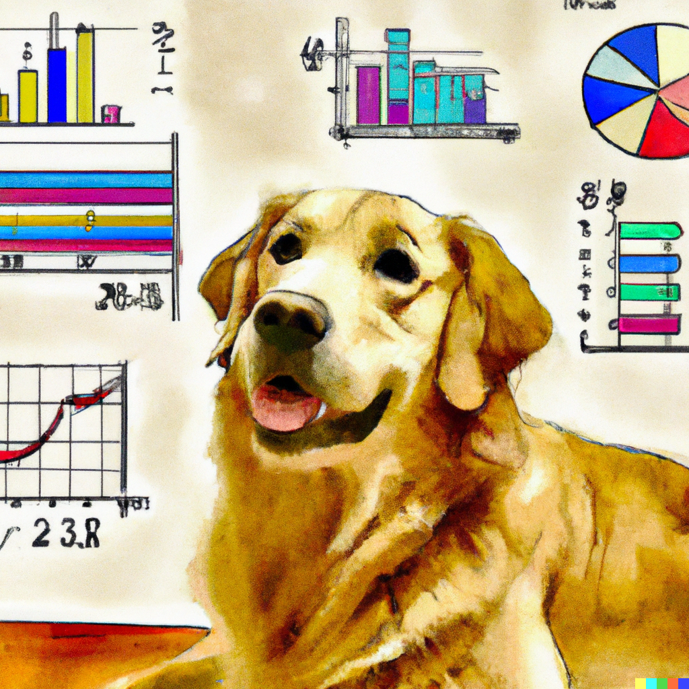

# An Introduction to Data Science

<iframe src="assets/videos/data-science-intro-slideshow.html" 
        width="100%" height="520" 
        style="border:none; border-radius:16px;">
</iframe>

## How to use this website

This website
- is intended for middle and high school students learning to apply statistics for the first time
- covers the basic statistical concepts and tests that are covered in an introductory statistics course
- was developed to accompany the learning materials of [Wisconsin Fast Plants](https://fastplants.org), but the knowledge can be applied for any statistics introductory course
- has code you can follow with [RStudio](https://posit.co/download/rstudio-desktop/) to generate similar figures & graphs as the website. Find the code [here](https://github.com/benrushscience/learning-data-science/blob/main/code/fast_plants_datawebsite_script.R). 

Each lesson 
- covers a basic overview of concepts and aims to provide the theoretical take aways without being bogged down by the math,
- has resources for students to learn more about the math behind each concept, but the main purpose of the website is to teach how to think about statistics. 

## Overall learning objectives

This website serves as an introduction to Data Science for middle and high school students and their teachers. 

Among the main topics, this website focuses on:

- Why Statistics is useful in the real world
- Statistics to understand genetic diversity
- Mean, variances, correlations and other summary measures from data
- Probability distributions
- Hypothesis tests (t tests, ANOVA, chi square tests)

## Topics and specific learning objectives

1. [I've never seen a dog](https://solislemuslab.github.io/learning-data-science/lecture-notes/1-introduction.html): Why data science?
    - By the end of this lesson, students will be able to:
        * Identify why statistics is helpful in the real world for assessing differences and patterns
        * Describe the challenges of determining differences and patterns
        * Discuss a comparison model of genetic diversity (dogs) for reference when thinking through the following lessons
2. [Genetic diversity](https://solislemuslab.github.io/learning-data-science/lecture-notes/2-genetic-diversity.html): Basics of DNA
    - By the end of this lesson, students will be able to:
        * Restate what genes and DNA are with analogies to cooking
        * Define genetic diversity, genetic variation, and gene expression
         Review core concepts in plants and animal genetic diversity
3. [Finding average ground](https://solislemuslab.github.io/learning-data-science/lecture-notes/3-averages-and-medians.html): Computing means and medians
    - By the end of this lesson, students will be able to:
        * Calculate the mean and median
        * Illustrate why the mean and median is useful when critically thinking about data
        * Describe and recognize how the median and mean can be skewed 
4. [Seeing (data) is believing (data)](https://solislemuslab.github.io/learning-data-science/lecture-notes/4-variance-and-distributions.html): Variances and distributions
    - By the end of this lesson, students will be able to:
        * Restate how the mean is helpful but is aided by variance to critically think about data distribution and skew
        * Calculate and describe what standard deviation is for a sample
        * Explain what distributions are and why the normal distribution is used frequently
5. [Catching z's](https://solislemuslab.github.io/learning-data-science/lecture-notes/5-probability-and-z-scores.html): Probabilities and z-scores
    - By the end of this lesson, students will be able to:
        * Discuss the basics of events happening in terms of probability
        * Describe how z-scores of a individual data point explain how common that data point is
        * Interpret how z-scores interact with distributions and how we obtain p-values from distribution and tables
6. [I love being rejected](https://solislemuslab.github.io/learning-data-science/lecture-notes/6-hypothesis-testing.html): Hypothesis testing
    - By the end of this lesson, students will be able to:
        * Describe and recognize a scientific hypothesis
        * Describe and form null and alternative hypotheses
        * Discuss how it’s impossible to know everything about all variables in space and time, so we reject the null hypothesis
7. [Things might be different now](https://solislemuslab.github.io/learning-data-science/lecture-notes/7-comparing-2-groups.html): Comparing 2 groups
    - By the end of this lesson, students will be able to:
        * Demonstratethe value of testing two groups statistically
        * Explain when and how to apply t-tests
        * Demonstrate how to and critique an interpretation of a t-test including:
            1. Test results
            2. T statistic
            3. How to reject the null hypothesis and its meaning
8. [More things might be different now](https://solislemuslab.github.io/learning-data-science/lecture-notes/8-comparing-2+-groups.html): Comparing more than 2 groups
    - By the end of this lesson, students will be able to:
        * Discuss the value of testing multiple groups statistically
        * Explain when and how to apply ANOVA
        * Demonstrate how to and critique an interpretation of an ANOVA test including:
            1. Test results
            2. F statistic
            3. How to reject the null hypothesis, and that this means there is a global group difference, but can’t tell which groups are different
        * Define a post-hoc analysis and explain how a post-hoc analysis yields additional results about multiple group comparisons
9. [Chi-square marks the spot](https://solislemuslab.github.io/learning-data-science/lecture-notes/9-comparing-frequencies.html): Comparing frequencies
    - By the end of this lesson, students will be able to:
        * Discuss the value of testing frequencies statistically for both goodness of fit and tests of independence
        * Explain when and how to apply chi-squared tests
        * Demonstrate how to and critique an interpretation of Chi-Square test including:
            1. Test results
            2. Chi-square statistic
            3. How to reject the null hypothesis, and that this means there is a global group difference, but can’t tell which groups are different
10. [What goes up must go down, or up, or nowhere](https://solislemuslab.github.io/learning-data-science/lecture-notes/10-correlations.html): Correlations
    - By the end of this lesson, students will be able to:
        * Discuss the value of testing two continuous variables statistically
        * Explain the difference between correlation and causation
        * Demonstrate how to and critique an interpretation of Pearson correlation and multiple regression test including:
            1. How to interpret an r-value
            2. How to interpret the results of a multiple regression test
            3. How to reject the null hypothesis and understand that rejecting the null hypothesis for a correlational test still means no causation
11. [With great power comes maybe good effect size](https://solislemuslab.github.io/learning-data-science/lecture-notes/11-statistics-in-the-real-world.html): Statistics in the real world
    - By the end of this lesson, students will be able to:
        * Discuss sample size and power
        * Identify when to use and the value of non-parametric tests
        * Describe effect size and why it is important in statistics
        * Underlines the importance and lengthy process of data cleaning
        * Illustrate real world applications of statistics that have been used to improve the world

{: .highlight }
If you want more statistical information in a free textbook, check out the digital library called [openstax](https://openstax.org/) and the textbook [Free Introductory Business Statistics](https://openstax.org/details/books/introductory-business-statistics).

## AI-generated artwork within the website
Images on this website are a mix of original and [AI-generated](https://www.mckinsey.com/featured-insights/mckinsey-explainers/what-is-generative-ai) images. Images that have a row of multicolored squares are from [Dalle2](https://openai.com/dall-e-2). There are many more and newer generative AI platforms out there!

