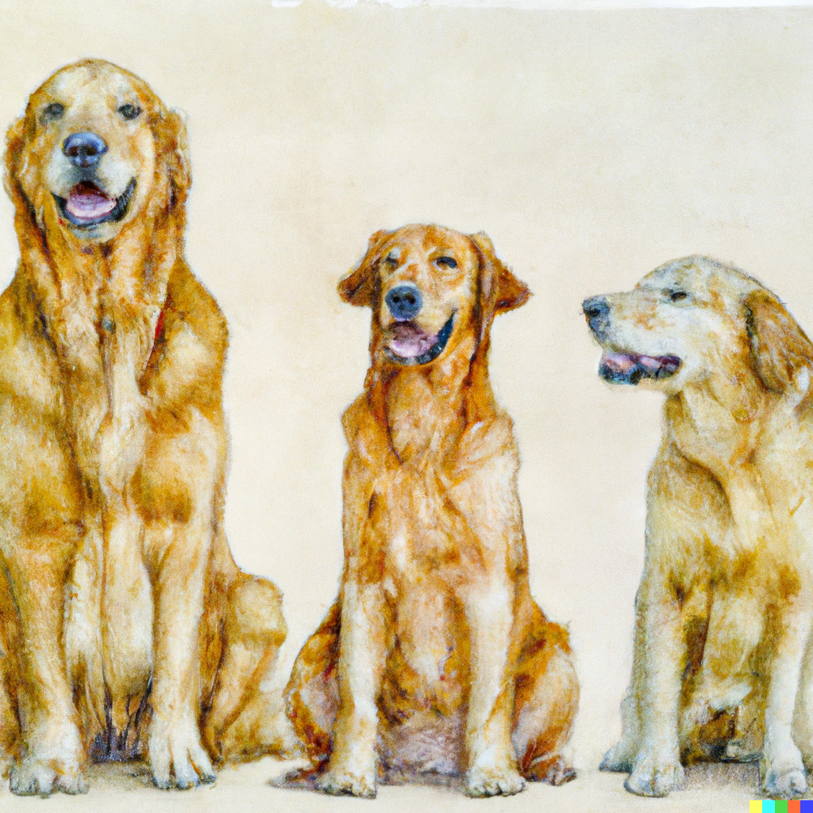
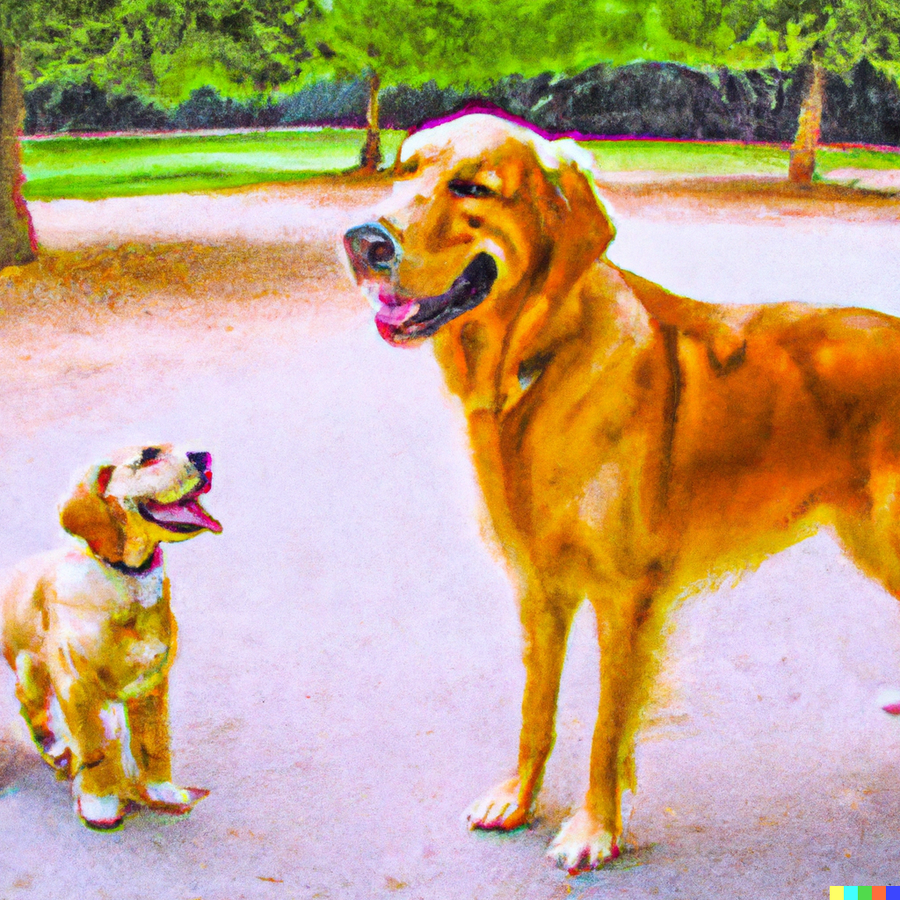
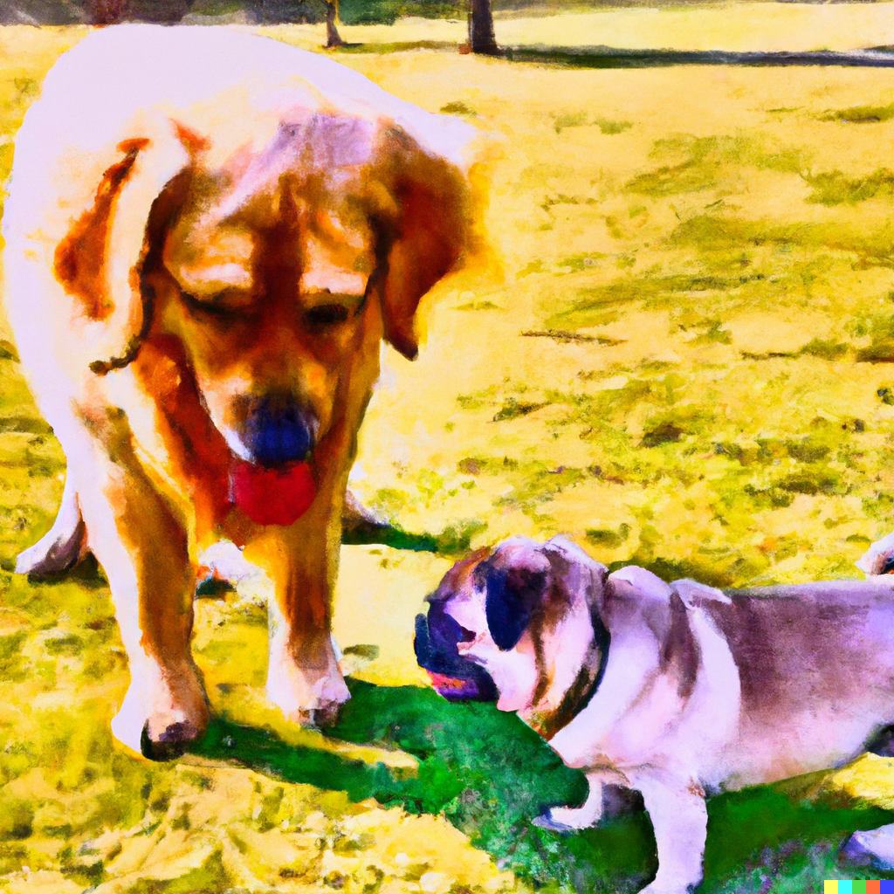
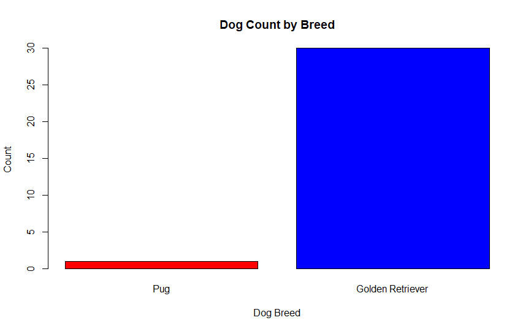

# I've never seen a dog
## 1. Why data science?

Imagine seeing a dog for the first time. Rhonda, the dog, is a golden retriever. She is friendly, loves fetching tennis balls, and wants to eat all of your food. Rhonda needs a home and fortunately you are able to take her home with you. You observe more about her over time including her brown eyes, how she takes up half of the couch when sitting on it, the mole on her nose, and her stinky breath. Despite her stinky breath, Rhonda is a great dog. For the first dog you’ve ever met, she is a good accidental find.  
 

 
Rhonda seems like the perfect dog, so why not show her off? The “National Competition for Best Golden Retriever” is just around the corner. You teach Rhonda how to sit, speak, and even salsa dance. She is ready for the competition. You arrive to find dozens of golden retrievers. Some have blue eyes, no moles, and maybe delightfully minty breath.  Although these are the first dogs you are seeing besides Rhonda, you can accept golden retriever height might vary when sitting. When Rhonda stands on all fours, she is 30 inches tall. As the golden retrievers dart around, you start to notice that most seem smaller than Rhonda. Maybe one is taller than Rhonda? Oh, that massive golden retriever is named Tank. He has won multiple awards for pulling cars… he loves those gains.  
 

 
Is Rhonda actually taller than the other golden retrievers? You might have a gut feeling that she is, but how do you provide evidence for her being taller? Can you compare Rhonda to every golden retriever in the world? Can you compare her to every golden retriever in the past? How about the ones that will exist in the future? Most likely you aren’t able to do this, unless you have the powers of time travel and also a lot of time on your hands (which if you have the power of time travel, you probably would). Trying to figure out if an observation or pattern is due to chance or not is where the field of statistics can help. Based on some of the traditional rules in statistics, we can provide evidence for whether Rhonda really is taller than the other dogs.  
 
If you compared Rhonda’s height to only one other golden retriever, could you say Rhonda is taller than other retrievers? Probably not. What if that other golden retriever is the ripped, award winning Tank? You might even think she is smaller for her breed.  
 

 
If you compared  Rhonda’s height to 5 other golden retrievers and found Rhonda was taller than 4 but still smaller than Tank, maybe you’d think she is only a little taller than other golden retrievers. What if you found Rhonda and Tank were taller than 30 other golden retrievers? You’d probably be a lot more confident that Rhonda is taller than most golden retrievers and that the next golden retriever you see would likely be smaller than Rhonda. (You might also conclude that Tank should get more hobbies than going to the gym- maybe he would love painting?).  
 
This is exactly the same thinking that is used in statistics. We are trying to make conclusions about an observation we saw: are Rhonda and a group of 30 other golden retrievers different? Using statistics can help us answer those questions. Statistics can also help us see if other dog attributes tend to change with one another. For example, we might be curious to see if the amount of food a golden retriever eats as a puppy is related to its height. Statistics can determine differences among characteristics of golden retrievers: Are golden retrievers with stinky breath like Rhonda just as popular as golden retrievers with minty fresh breath? Do golden retrievers with blue eyes have a higher rate of having stinky breath versus golden retrievers with brown eyes?  
 
Finding out all the differences and similarities using statistics is extremely helpful in all sorts of applications- studying the brain, how humans behave, how plants might be related, discovering new pharmaceuticals, determining fair housing practices, and so much more. This is especially true when genetics can produce widely different appearances, yet keep the genetic makeup of a species similar. Imagine the only species of dog you’ve ever seen is a golden retriever… and then you see a pug “running” at a dog park. What?! That’s a dog?!?  
 

 

 
You might be working on a project using [Wisconsin Fast Plants](https://fastplants.org/) for an interactive journey cultivating Brassica rapa plants. Fast Plants provides a unique platform for teaching basic statistical concepts through hands-on observation of plant traits like height, germination time, leaf number, and flowering time. You can collect data to calculate averages, dispersions, and correlations, fostering a practical understanding of statistical analysis within the context of biological growth and genetics. We will touch on all the statistics involved in Fast Plants on this website, but other projects can still benefit from this website, too! This project engages students in both scientific exploration and statistical learning, offering a comprehensive educational experience.
 
 
Continue to the “genetic diversity page” to learn how this can happen…

| [Home](https://benrushscience.github.io/learning-data-science/) | [Next](https://benrushscience.github.io/learning-data-science//pages/2-genetic-diversity.html) |
