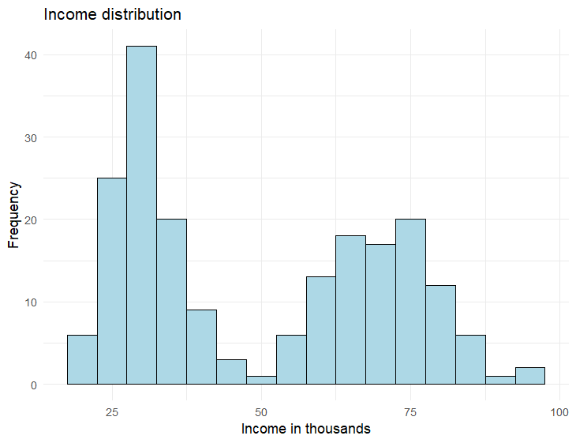

# With great power comes maybe good effect size
## 11. Statistics in the real world

As you’ve seen, choosing the right statistical test can depend on what question you are asking, the variables you have, and meeting the assumptions of each test. However, there are additional considerations that statisticians and data scientists take into account to ensure accurate and meaningful results. It’s also important to mention that all statistical tests help provide evidence for a hypothesis being tested, but real-world data are messy. Data collection and cleaning take up a significant amount of time in statistical work. Collecting accurate and representative data are crucial for meaningful analysis. Researchers must design appropriate experiments or surveys, gather data systematically, and ensure data quality by checking for errors and inconsistencies. Cleaning and preparing the data for analysis can be a time-consuming process, involving removing outliers (extreme values), resolving missing data problems, and organizing the variables.  
 
Some of the assumptions that are needed by each test may not be perfectly met but the test still may be applied. Some tests, like the Pearson correlation test which requires a normal distribution, can still provide meaningful results even if the distribution isn't strictly normal, provided it isn't too far off from a normal distribution.. What is too non-normal? Well… like many things in the world, there isn’t perfect agreement on what “too” non-normal is. This is where thinking critically about your statistical tests is critical. You may violate the normal distribution requirement for a Pearson correlation test if the distribution is close to normal; this is because the r-value is commonly used and is interpretable by individuals who aren't statistical experts. There are a few alternatives to a Pearson correlation test that can handle non-normally distributed data (and there usually are alternatives for almost any test to handle non-normally distributed data), but the result might be harder for non-experts to understand. This is where being transparent about what you did with your data and how you analyzed it is also critical. You may put on a paper, blog, mention in conversation, etc, that you broke the normal distribution assumption because the distributions was only slightly off and you felt more people could benefit from knowing how to understand a typically used test, but this violation of the normal distribution assumption would be a limitation of your work that should be mentioned. 

If you sampled a small tech company about their employees' incomes, you might have a distribution like the one below. This bimodal distribution indicates suggests there are two possible groups occurring in the data. Perhaps the spike on the left reflects the employees who have worked for the company for less than 5 years while the spike on the right reflects senior management. Perhaps measuring employee income isn't the best variable to assess then, but it might be useful if looking only at newer employers, senior employers, or comparing these two groups with a t-test, but income distribution like it is below would not be a good variable to use for correlation testing. 
 

  
 
Beyond choosing the right test, making sure you have a large enough sample size is also an important consideration. Sample size plays a key role in statistical analysis. A larger sample size generally leads to more reliable and accurate results. With a larger sample, we can better understand the characteristics of the sample we are studying and make better predictions. However, collecting a large sample can be time-consuming and costly, so researchers must strike a balance between the practicality of getting the work done and the need for accurate conclusions. We can determine the needed sample size using a technique called power calculations. 
 
Statistical power refers to the ability of a statistical test to detect a true effect or relationship. A high-powered analysis is more likely to find significant results if they truly exist. A low-powered analysis might yield a non-significant result, even though true differences exist in the real world! To achieve sufficient power, researchers need to consider factors such as sample size, effect size, and the desired level of significance. The necessary power for each statistical test can be calculated with statistical software, and for simplicity, we will just mention this idea of power and not delve further here, but if you are curious, 
below is a power/ sample size calculator developed by Statistics Professor Dr. Claudia Solis-Lemus.  
 
<iframe src="https://solislemus-lab.shinyapps.io/sample-size-shinyapp/" width="800" height="600"></iframe>
 

Assumptions for statistical tests are assumptions about the data that must be met for the statistical test to produce accurate results. For example, many tests assume that the data follows a normal distribution. If the data are non-normally distributed, non-parametric tests can be used as an alternative to the desired statistical test. Non-parametric tests do not rely on specific distributional assumptions and are more flexible in analyzing different types of data. Some common non-parametric tests include the Mann-Whitney U test, which compares two groups (alternative to t-tests), the Kruskal-Wallis test, which compares more than two groups (alternative to ANOVA), and the Spearman correlation test, which analyzes continuous data (alternative to Pearson correlation test). These tests rank and compare data without assuming a specific distribution, but still have some assumptions that need verifying. Non-parametric tests are often used when data is skewed, contains outliers, or violates other assumptions of parametric tests. A down-side is that not everyone knows how to interpret non-parametric tests, so it could be harder to tell people the results of your work. 
 
Many researchers care about the p-value of a statistical test, viewing a smaller p-value as an indication of a stronger relationship between their test variables, but that is not true. P-values indicate how likely the results from a statistical test are due to chance, but not the strength of the relationship between variables. To evaluate the strength of relationships between variables, effect size is calculated. Effect size provides valuable information about the practical insight into the real-world impact of the variables being studied. Each statistical test has a way of calculating its effect size and effect size can be very helpful for decision making, especially if large amounts of money and personal health is on the line. 
 
It is possible to have a statistically significant result, but low impact. We could find a statistically significant difference of a new pharmaceutical drug that lowers blood sugar, but we find out it only reduces blood sugar minimally. The American Diabetes Association defines normal fasting blood sugar at 100 mg/dl (milligrams per deciliter) or below and the diagnosis for diabetes starts at a fasting blood sugar of 126 mg/dl. We could find the drug significantly reduces fasting blood sugar… but only by 1 mg/dl. This would be a very small reduction in fast blood sugar. Do you think someone with diabetes would be willing to pay $400 per week for this marginal reduction? Maybe, but probably not if another drug on the market already could reduce fasting blood glucose by 5 mg/dl for the same price. 
 
To summarize all these lessons, statistical tests are incredibly important to gain insight and evidence into the hypotheses we have about the world. Our beliefs about dog breeds, crop production, health, finances, and so much more rely on decisions, which can be informed from research that rely on statistics for evidence. Statistical tests are amazing tools that can be leveraged for clearer interpretation of the world, but keep in mind that 1 result does not establish a pattern and that any study will have its strengths and weaknesses. One quote from a British statistician, George Box, is helpful to remember- “All models are wrong, some are useful.” Statistics can yield insightful results but they should be taken into the context of the subject being studied. Were there other studies that contradicted the results? Why could that be? Who and what were being studied? When and where? It’s impossible to create the perfect study, but using statistics helps us gain more knowledge about the world and unlock the hidden patterns behind everything!  

Get inspired about how statistics can help change the world with the videos below:
<iframe width="560" height="315" src="https://www.youtube.com/embed/hVimVzgtD6w" frameborder="0" allow="accelerometer; autoplay; clipboard-write; encrypted-media; gyroscope; picture-in-picture" allowfullscreen></iframe>  
 
<iframe width="560" height="315" src="https://www.youtube.com/embed/eE4qCJBgfIk" frameborder="0" allow="accelerometer; autoplay; clipboard-write; encrypted-media; gyroscope; picture-in-picture" allowfullscreen></iframe>  
 
<iframe width="560" height="315" src="https://www.youtube.com/embed/Z1-AHywHi4w" frameborder="0" allow="accelerometer; autoplay; clipboard-write; encrypted-media; gyroscope; picture-in-picture" allowfullscreen></iframe>  
 
<iframe width="560" height="315" src="https://www.youtube.com/embed/_2u_eHHzRto" frameborder="0" allow="accelerometer; autoplay; clipboard-write; encrypted-media; gyroscope; picture-in-picture" allowfullscreen></iframe>  
 
<iframe width="560" height="315" src="https://www.youtube.com/embed/oUs1uvsz0Ok" frameborder="0" allow="accelerometer; autoplay; clipboard-write; encrypted-media; gyroscope; picture-in-picture" allowfullscreen></iframe>  

| [Home](https://benrushscience.github.io/learning-data-science/) |
