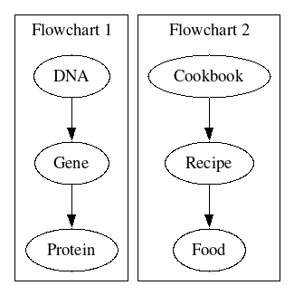

# In the a world of possibilities...
## 2. Genetic diversity

You know dogs come in all shapes, sizes, and personalities, yet they are still one species- domesticated dog (or if you prefer fancy Greek, Canis familiaris). How is this possible? The answer lies in dog DNA. DNA is the recipe book for any living thing. You have it. Dogs have it. Plants, your favorite TikToker- we all have DNA. Within our huge cookbook of DNA are individual recipes, or genes. Genes are the recipes for specific proteins, which are microscopic molecules that do all sorts of different things in our bodies. Proteins are like the foods from the recipes. Sometimes you want tacos for lunch. Sometimes you might want pizza. Each gene has the recipe for our food, but obviously we don’t want to cook every food all of the time, so any organism must control when a gene is turned on, or in biology speak - expressed. If the recipe is open and being cooked, just like a gene in our DNA is on and expressed, we get our food item and our protein.  
 
[_For a brief overview of DNA to protein, check out the video from Professor Dave_](https://www.youtube.com/watch?v=bKIpDtJdK8Q)   
 
Why should you care about proteins? Well, you wouldn’t be reading this, or breathing, or doing any sports, playing any video games, studying, or anything you could possibly imagine without proteins. Proteins make up our muscles, capture light in our eyes, make up our hair, help us sweat, and so much more. Proteins are part of the building blocks that allow our body to do what it does- let us exist.  
 
So how are proteins created? Going back to the cookbook example, the recipe for a food instructs how to make the food. The recipe for a protein in our body is called a gene. Many genes together form our DNA, and DNA is like our own, personalized cookbook. So, our bodies read the genes (recipes) in our DNA (cookbook) to create proteins (the food), which allow us to function in the world. 
 
Of course, we humans vary in lots of ways – hair color, height, what we taste, the freckles, and even the colors we can see (see tetrachromacy for a rare way some humans are able to perceive color) ! This happens because of two main reasons- genetic variation and gene expression.  
 
Genetic variation is the concept that our genes (the recipes) can vary even though the genes might be for creating the same protein (the food). This is like getting recipes for mac and cheese from different friends’ families. One family might put breadcrumbs on top, another might cover theirs in hot sauce. In the end, the families cook mac and cheese even if the recipes cause some variation in the mac and cheese. This is exactly like genetic variation! Genetic variation can even explain why some individuals taste soap when eating cilantro and why people have different types of ear wax.  

 
Gene expression refers to how much of a gene is read to make a protein. This is like having a recipe for tamales (the gene), but choosing how many tamales you actually make (the amount of protein made). This could lead to genes being highly expressed or not expressed at all! Humans have the gene to make vitamin C, but through eating so much food with vitamin C in our ancestry, our bodies turned the expression of the vitamin C gene to zero to save on energy and resources that goes into making vitamin C.  
 
So how does this all relate to Rhonda and the pug at the dog park? Despite looking extremely different, Rhonda and the pug have almost the same exact DNA! The small amount of gene variation and gene expression between the two dogs leads to the variation in height, snout length, and coat color (and more). Perhaps that even explains Rhonda’s stinky breath?  
 
So now we’ve talked about dogs and humans… but you may be learning about plants. It’s finally time to bring it all together. It’s the moment you’ve been waiting for. Just as soon as this sentence is over, it will all make sense. Just as soon as this sentence is over, too. Maybe another one to really build the tension. Okay. Are you ready? You’re still reading this, so you probably are. Good for you for reading this sentence as well and not just skipping this paragraph.  
 
Plants, just like humans and dogs, have DNA and that DNA has genetic variation and those genes vary in their expression. This is a deliciously wonderful fact! Because of genetic variation and gene expression, that little brassica you might be growing has almost identical DNA to broccoli, Brussel sprouts, bok choy, collard greens, mustard, and cauliflower. Your little brassica plant might be the pug in this case, but its relatives can carry intense flavor (mustard), be used to produce cooking oil (canola), or be a vegetable in foods around the world (broccoli).  
 
[images of the plants?]  
 
To help illustrate the genetic diversity of the brassicas (and also what can happen in dogs and humans), you may have completed activities to count and measure physical characteristics of a plant.. The physical characteristics, like hairiness, leaf size, leaf color, number of seeds, and more can be the morphological traits, or physical traits that we can observe, of an organism. The morphological traits are influenced by both the genetics of an organism and its environment. A species may typically grow to a certain size, but if it can’t find enough food, it might not be able to grow to the typical height. As you’ve learned a bit now and will continue to learn, what a “typical” height is takes some measuring and statistics to find out, but it can help us know if an organism is healthy.  
 
A typical height and growth rate for your fast plant is known, and so are typical growth rates for crops, dogs, and humans. Although many factors influence the typical growth rate, if a parent has a human baby that is smaller than the “typical” baby at a certain age, doctors may be able to intervene to address a nutritional deficiency, disease, or toxin that could be affecting the growth.  
 
So, knowing the difference between a random observation and providing evidence for a pattern can save lives! That’s the power of statistics, which we dive back into on the next page.  

| [Home](https://benrushscience.github.io/learning-data-science/) | [Next](https://benrushscience.github.io/learning-data-science//pages/3-averages-and-medians.html) |
