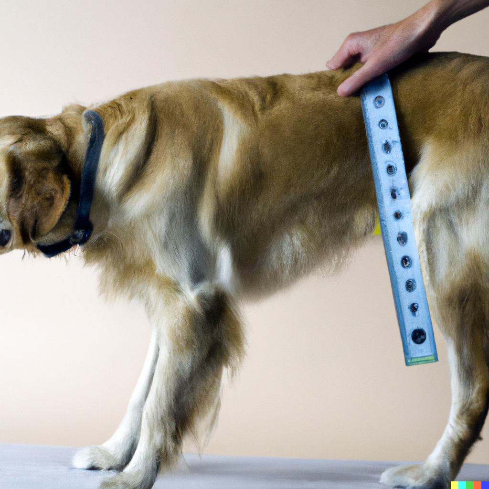
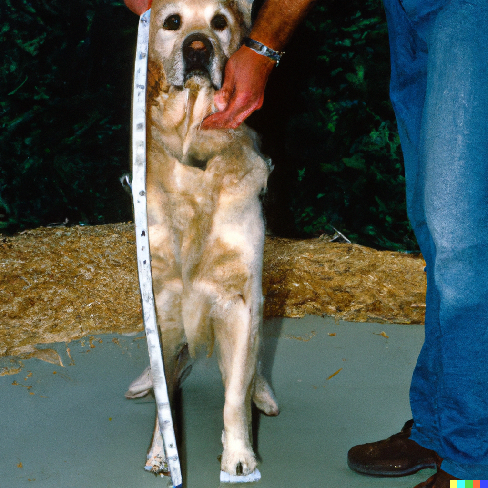

# Finding middle (and average) ground
## 3. Averages and medians

So now we know that we should expect some genetic variation in DNA among any population of organisms- plants, dogs, humans, koalas, yeast, worms- and that the environment will play a part in how much those organisms’ genes are expressed. We know that genetic variation, gene expression, and the environment will affect those organisms’ morphologies, which is important as that could influence crop yields, disease risk, survival, and even start-up businesses. So how do we know the “typical” value of a trait we are interested in? This could be like asking how many potatoes should we get per purple potato plant? How many purple cauliflower plants should germinate from seed? We could guess whatever we wanted, but we could also be completely wrong. If we start collecting data, we can get closer to the truth. Although we want to get to the truth of a “typical” value for some trait or variable of interest, you will see it is an impossible but highly valuable and rewarding task.  
 
First, we will need to think about what data and the type of data we want to collect. We generally have two types of data, or variables, we could select. One type of data is called a continuous variable. Continuous variables can have infinite possibilities like a smooth spectrum, where you can find values in between any two points. In our case, our continuous variable is height. Height does not have discrete, integer values (0, 1, 2) and varies along a big spectrum (0 to whatever is limited in biology) with values that can be in between integers (23.445, 10.5, 45.009 inches, which are all acceptable for a continuous variable). The other type of data is called a categorical variable. Categorical variables have discrete values that do not make any sense to have values in between the values (there is not a half pug, half golden retriever, or half New York City or half Milwaukee group). In statistics, continuous variables change smoothly (like temperature), while categorical variables are divided into distinct groups (like golden retrievers or  pugs).  
 

| Continuous Variables| Categorical Variables |
| :---:   | :---: |
| Height | Gender |
| Weight | Blood Type |
| Temperature | Nationality |
| Age | Hair Color |
| Salary | Car Brand |
| Distance | Relationship Status |
| Speed | Education Level |
| Volume | Animal Species |
| Time | Movie Genre |
| Pressure | Operating System |

 
[_For more info about reading charts, categorical, and continuous variables, see this video from Khan Academy._](https://www.khanacademy.org/math/statistics-probability/analyzing-categorical-data/one-categorical-variable/v/identifying-individuals-variables-and-categorical-variables-in-a-data-set)  
 
Next, we will need to define how we assess our variables. Let’s say we wanted to determine the height of golden retrievers. We need to define how we measure height for golden retreivers. Should height be when a golden retriever is sitting down? Should it be when a golden retriever is laying down? Should it be measured from the end of the tale to the end of the snout? The answer will probably vary depending on whom you ask. In science, there can be some heated arguments on how to even define a term. This might seem silly (and sometimes it is), but a definition can have huge impacts. Imagine if NASA astronauts were fitted in suits according to their heights, but height was only measured from their ankles to their necks. These poorly fitting suits would likely not fit at all, and put their lives at risk. Indeed space exploration, roller coasters, and plane fights have been in jeopardy because of different groups measuring length in metric units (example-meters) versus empirical units (example- yards).  
 

  
Is this height?   

  
Or is this height?   
  
The American Kennel Club defines a dog’s height in inches from the bottom of its front paws to the top of its shoulder, not taking into account the head (the head could be up or down when measured, so the height could vary drastically!). Now that we have a definition of height, we can start measuring the height of the golden retrievers.  
 
Let’s say we sampled and measured the heights of 30 golden retrievers (which hopefully didn’t take much time, but waiting and collecting data can often be the longest part of a scientific experiment!). How can we get a summary of the data we collected? Two main ways of trying to summarize a central point in data are with averages (also called means) and medians.You’ve probably heard of both averages and medians, and in a statistical and data science context, they are very important!   

[maybe cartoon of dogs with heights and then each measurement is placed as a dot in an axis)]  
 
As a refresher, the average of measurements is the sum of all of the measurements divided by the number of measurements taken. The average height of golden retrievers in our example would be the sum of the heights of all 30 golden retrievers divided by 30.This helps us summarize the data from 30 data points into 1 number. Expressed in a mathematical formula, an average is:  

 x = x1 + x2 ...  + xnn  
 
where 𝔁 is the average x1 is the first height measurement, x2 is the second height measurement, the “.. + xn” means all the measurements until the last measurement, and n is the number of measurements we took.  
 
[add the mean in the dots plot; we can say that the mean is the value that balances the whole plot]  
 
The median is the middle measurement of the sample we took. To do this, we would sort all of our measurements from lowest to highest and then start crossing off the outer numbers (eliminate measurement 1 then 30 then 2 then 29) until we are left with 1 number in the middle, In our case with 30 numbers, we will not have one middle number. Instead, we would have measurements 15 and 16, and in this case, we would average the values of these numbers together to create the median. For example, if the 15th measurement was 21 inches and the 16th measurement was 22 inches, we would average those measurement values to achieve a median of 21.5 inches. You could imagine this process would take a long time for larger samples (and samples could be in millions)- fortunately computers are great at finding medians.  
  
[cartoon or video of this process]  
 
In a perfect theoretical sample, the mean and median would be the same. As you can guess, the world, the samples we measure, and the human training of cats are imperfect. The mean and median are usually close, but both can be influenced by the data we collect in our sample. Imagine we collect the salaries of adults in an imaginary small town of 1,000 people. The town, Roseville, has a grocery store, a few small businesses, and is largely surrounded by farmland. Almost all 999 people earn around $60,000 per year except the 1 billionaire who wanted to escape the city and move to a country town. She earns $2,300,000,000 per year. Her massive income massively increases the average income of people in Roseville. The average income of a person living in Roseville is $2,359,940 despite 99% of people making $60,000 per year. The billionaire’s income skews the average substantially. However, the median income would still be $60,000. The median of a dataset tends to be less sensitive to outliers, or extreme values, like the billionaire’s income.  
 
[plots of this in cartoon form]  
 
Median’s are not perfect and still could hide how the data looks. Let’s say the billionaire’s adult son moves to Roseville, increasing its population to 1001 people. Inspired by websites about data science and her desire to make it easy for the writers of this website you are reading, the billionaire decides to adjust her yearly income in a new way. Through a strange lottery system, she ensures 500 people have an income of $100,000, her son earns $300,000, and the other 500 people of Roseville earn $2,000,000. The average income is $1,049,250 and the median income is $300,000. The middle value of our sample, our median, is $300,000, but is that value useful? It does not fully capture the spread of yearly incomes and really only reflects the son versus the strange incomes of folks in Roseville.  
 
[_For a more in depth refresher of means, medians, and modes, check out this video from Khan Acacdemy._](https://www.khanacademy.org/math/statistics-probability/summarizing-quantitative-data/mean-median-basics/v/statistics-intro-mean-median-and-mode)  
 
So, as you’ve seen, the mean and median are very useful and can give us good insight into a sample by summarizing something we are interested in into 2 numbers. But you could also see how the mean and median don’t always represent the full picture of a sample. For a better picture, let’s actually look at some pictures! Well, to be fancy scientists, we will call them figures. The next lesson will cover describing how a sample might vary and how we can visualize that sample to help us understand samples.  

| [Home](https://benrushscience.github.io/learning-data-science/) | [Next](https://benrushscience.github.io/learning-data-science/pages/4-variance-and-distributions.html) |
