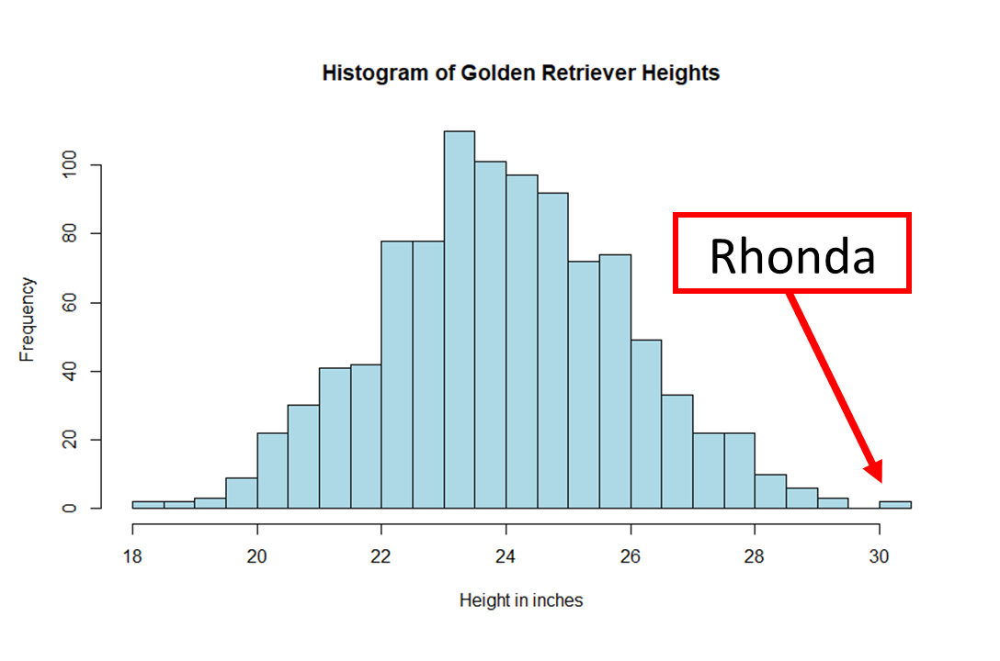

# Seeing (data) is believing (data)
## 4. Variance and distributions

So we’ve seen the use of means and medians, but could still get fooled by these one number summaries. You may have experienced this with concert tickets. A seller might list the average ticket price of a concert of $20, then on the website you see the best seats are actually $100 with terrible seats at $5. The seller could easily change the number and price of tickets in all sorts of ways to make the average seem affordable. That’s why having an idea of the spread of ticket prices, or the spread of whatever data we might be interested in, can help us be smarter buyers.  
 
In the world of statistics, two important measures called variance and standard deviation help us understand how data points differ from the average and how much the data is spread from the average. Let’s think about Rhonda’s 30 inch height again. 
 
When we talk about variance, we're talking about how much the individual heights of golden retrievers in our dataset differ from the average height. It helps us understand if the heights of the dogs are mostly similar or if there is a wide range of heights. Variance is calculated by taking the squared difference between each height and the average height, adding them up, and then dividing by the number of measurements in our sample.  
 
[Formula]  
 
Now, standard deviation is a measure that is easier to understand. It's like the "average amount of difference" from the average height. We can think of it as a typical or average distance that golden retriever heights deviate from the mean. Standard deviation spreads of continuous variables typically follow a similar bell-shaped curve pattern. By knowing the standard deviation and mean of golden retrievers' heights, we can understand a lot about the spread of height data. If the average height of golden retrievers is 24 inches and the standard deviation is 2 inches, we can expect most golden retrievers to have heights that range from 22 to 26 inches. In a bell shaped curve, we can use the mean and standard deviation to figure out the proportion of the sample that have certain heights.  
 

[Bell shaped curve plus example of proportions. Calculate Rhonda’s probability of being that tall]  
 
Understanding the variance and standard deviation of Golden Retriever heights can be helpful for different reasons. Breeders can use standard deviations for expectations of a dog breed’s heights. For veterinarians, standard deviation helps determine if a Golden Retriever's height is within a normal range for its age and breed, which can be important for monitoring their health. For us, standard deviation lets us know Rhonda is amazing and we should give her too many toys.  
 
[_For more about visualizing data curves, check out this video from Khan Academy._](https://www.khanacademy.org/math/statistics-probability/modeling-distributions-of-data/density-curve/v/density-curves)  
 
We could get an idea of what a sample of data looks like based on means and standard deviations alone, but it can be easier to fully visualize the what our data looks like based on its spread, or distribution. (More visualization [here](https://www.khanacademy.org/math/statistics-probability/displaying-describing-data/quantitative-data-graphs/v/ways-to-represent-data)). In many cases of how data is distributed, the pattern follows a concept called a “normal distribution”. Normal distributions are patterns that often appear in data and we have seen one already! They have a special bell-shaped curve, with the highest point in the middle. In a normal distribution, data is evenly spread around the average, with most values near the middle and fewer values as we move away from the average. Many real-world things, like heights for golden retrievers or humans, tend to follow a normal distribution. Understanding normal distributions helps us make predictions and compare data.  
 
There are cases when values for a variable we are interested in do not follow a “normal distribution”. Sometimes extreme values, or just the way a variable is, leads to skewed data distributions. Skewness is a concept that helps us understand the shape and symmetry of data. When data is skewed, it means that it is not evenly or normally distributed. Skewed data distributions can be skewed to the left, where the longer tail is on the left side, or skewed to the right, where the longer tail is on the right side. Skewness tells us if our data leans more towards one side or if it is balanced. Understanding skewness helps us recognize different patterns in data and interpret information accurately.  
 
[_For more on skewness on curves, check out this videom from Khan Academy._](https://www.khanacademy.org/math/statistics-probability/modeling-distributions-of-data/density-curve/v/median-mean-and-skew-from-density-curves)  
 
Example non-normal- Weds at the McDonald's on time square  as of 7-17-23  
 
Example skewed left - Saturdays at the Mc Donald’s on time square as of 7-17-23  
 
Histograms, like the two pictures above, are visual representations that help us understand the distribution of continuous data. Histograms display data in organized bars or columns on a graph. Each bar represents a range of values, and the height of the bar shows how many data points fall within that range. Histograms allow us to see patterns, such as the most common values or any outliers. They help us understand the shape of the data, whether it is symmetric, skewed, or has other unique characteristics. By using histograms, we can analyze and interpret data more easily, making it a valuable tool in understanding information visually.  
 
[_If you want more info on creating histograms, check out this video by Khan Academy._](https://www.khanacademy.org/math/statistics-probability/displaying-describing-data/quantitative-data-graphs/v/histograms-intro)  
 
To summarize, variance and standard deviation help us measure how data points differ from the average and give us an idea of how our continuous data is spread. These measures are important tools in statistics that allow us to better understand and analyze data in many different fields and trends. They can even help us be smarter shoppers and buyers (or visitors to restaurants in busy areas!). The spread of data is often the first step of interpreting data and is also useful for when you begin to analyze data.  

| [Home](https://benrushscience.github.io/learning-data-science/) | [Next](https://benrushscience.github.io/learning-data-science/pages/5-probability-and-z-scores.html) |
