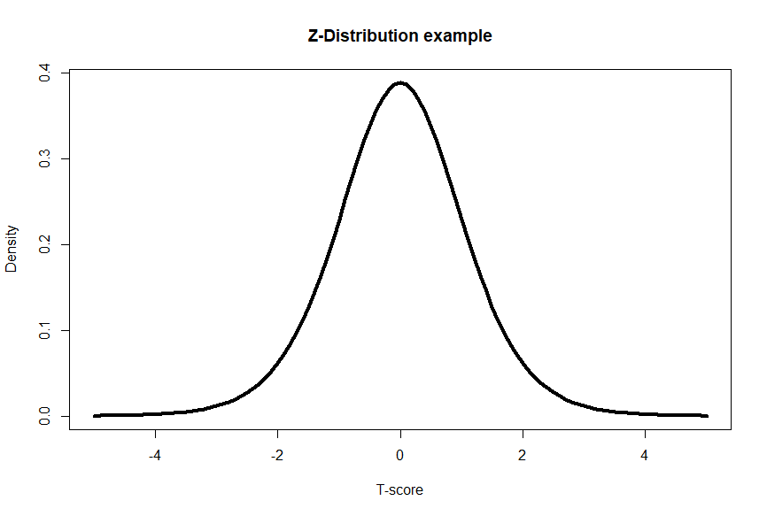
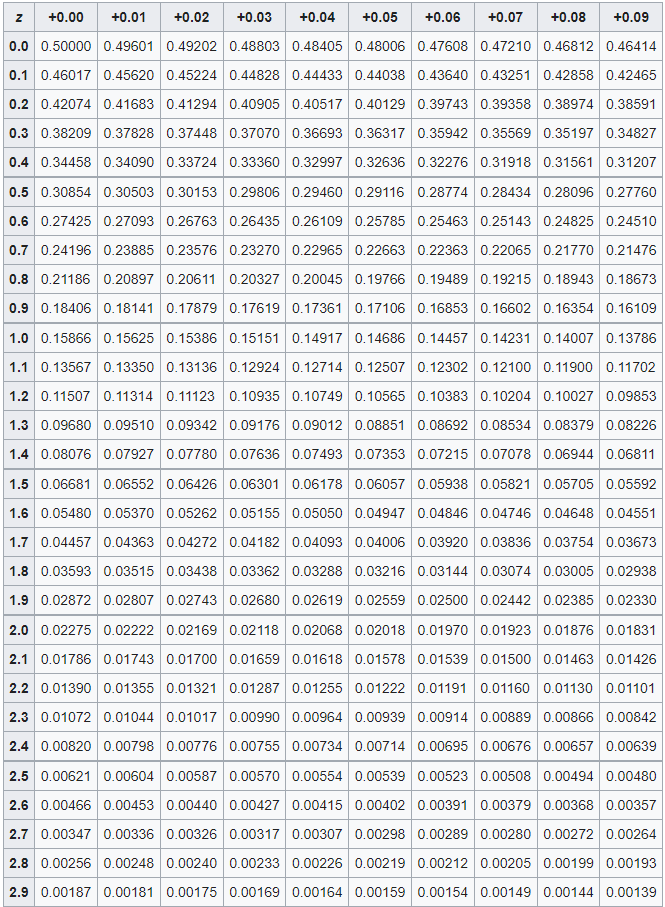
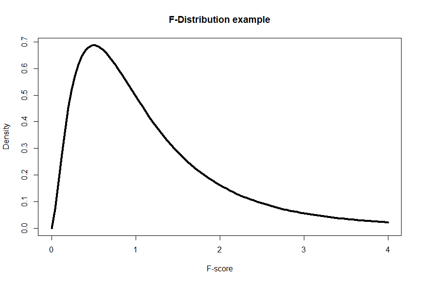
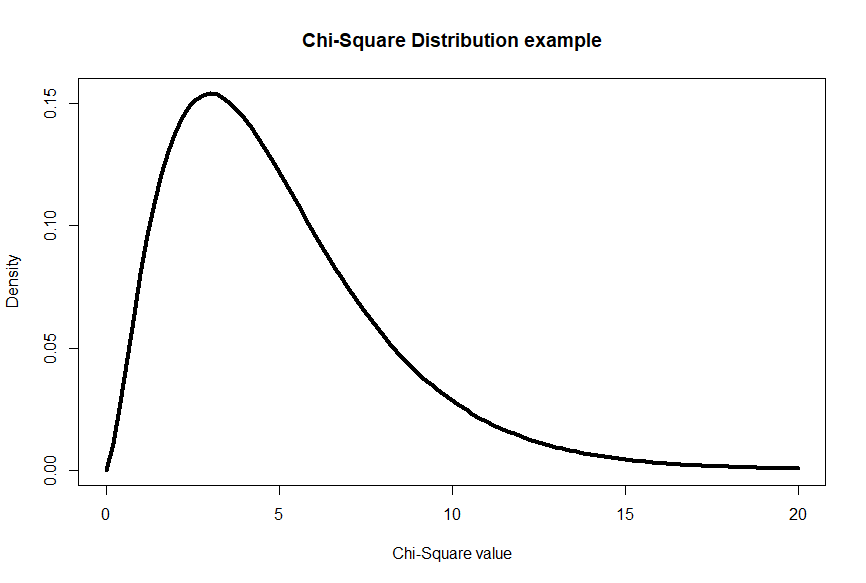

# Catching z's 
## 5. Probability and z-scores

You’ve probably, most likely, heard of the concept of probability. Probability helps us understand the likelihood or chance of an event occurring. It plays a crucial role in statistics and allows us to make informed decisions based on data. Probability represents the likelihood of an event happening and is expressed as a number between 0 and 1. A probability of 0 means an event is impossible, while a probability of 1 means it is certain to occur. Most probabilities in life are not 0 or 1. The probability of flipping a coin and getting heads is 0.5 since there are two equally likely outcomes, heads and tails. The probability that you might become the CEO of a business in Indiana is not 0, but might be low, especially if you never see yourself living in Indiana. On the other hand, the probability of Rhonda, our hypothetical golden retriever, being a good girl is 0.99 (she chases after squirrels periodically).  
 
[_For a more in depth introduction to probability, check out this video from Khan Academy_](https://www.khanacademy.org/math/statistics-probability/probability-library/basic-theoretical-probability/v/basic-probability).  
 
Thinking about Rhonda and her height, how can we score her against the other golden retriever heights? Z-scores are a statistical tool that allows us to standardize and compare data. They help us understand how far a data point is from the mean, in terms of standard deviations. A positive z-score indicates a value above the mean, while a negative z-score indicates a value below the mean. The further distance a data point’s z-score is from the mean indicates how uncommon the data point’s value is.  
 
[_For a more in depth understanding of z-scores, check out this video from Khan Academy_](https://www.khanacademy.org/math/statistics-probability/modeling-distributions-of-data/z-scores/v/ck12-org-normal-distribution-problems-z-score).  
 
Let's assume that the mean height of golden retrievers is 24 inches, with a standard deviation of 2 inches. With that information, we can calculate Rhonda’s z-score. Calculating a z-score is done by subtracting the mean from the measurement of interest and dividing the result by the standard deviation. So for Rhonda’s height, we take 30 - 24 (=6), then divide 6 by 2 yielding a z-score of 3. This process allows us to standardize the data and compare it on a common scale.  
 
[_For a more in depth understanding of comparing z-scores, check out this video from Khan Academy_](https://www.khanacademy.org/math/statistics-probability/modeling-distributions-of-data/z-scores/v/comparing-with-z-scores).  
  
But how does probability come into play? Well, probability helps us determine the likelihood of obtaining a specific z-score or a more extreme value. It allows us to assess how unusual or rare a particular data point is within its distribution.To interpret these z-scores in terms of probability, we can consult a standard normal distribution table or use statistical software.  
 
For the Golden Retriever with a z-score of 3, we find that the probability associated with this z-score is approximately 0.997. This means that there is a 99.7% chance of randomly selecting a Golden Retriever with a height smaller than Rhonda's. We can also say there is a 0.13% chance that a randomly selected Golden Retriever would have a height larger than Rhonda’s. As we thought, Rhonda is a special dog.  

The Z-distribution, an example of a standard normal distribution, is a continuous probability distribution with a mean of 0 and a standard deviation of 1. It is symmetric and bell-shaped. The Z-distribution is derived from the normal distribution and is used when working with sample means or proportions, often in the context of hypothesis testing or constructing confidence intervals. The Z-distribution is standardized, meaning any normal distribution can be converted to a Z-distribution by subtracting the mean and dividing by the standard deviation.  
 

 

That's wonderful that we can have a standardized z-score, but the usefulness of a z-score comes from translating the z-score into a probability value (p-value). In the table below, you can see that as you increase the z-score by 0.1 (in the rows) or by 0.01 (for each column) the values inside the table decreases. The values inside the table are indeed p-values! Let's say we had a z-score of 2.14- would first go down the row until we see 2.1, then go right to the +0.04 column (in total we have 2.1 + 0.04, for a z-score of 2.14). Inside that cell, we have a p-value of 0.01618. This means that the probability of a z-score being higher than our z-score is 0.01618 or a 1.618% chance. That chance is pretty low!

  

You can also use z-scores tables, or other distribution tables, can have more rows for larger z-scores. We would similarly see the p-values become much smaller as the rows continue. Z-scores of 4 or more have p-values of 0.00003 or less.This means there is a SUPER small likelihood of another z-score being larger than the one we just calculated. For more z-score tables visit this [Wikipedia page](https://en.wikipedia.org/wiki/Standard_normal_table)

[_For a more in depth understanding on how to compare z-scores and probability, check out this video from Khan Academy_](https://www.khanacademy.org/math/statistics-probability/modeling-distributions-of-data/normal-distribution-calculation/v/z-table-for-proportion-below) AND
[_to determine the percentile of a score..._](https://www.khanacademy.org/math/statistics-probability/modeling-distributions-of-data/normal-distribution-calculation/v/finding-z-score-for-a-percentile).  
 
Now, we have a tool that can help us determine the probability of a data point having a specific value- essentially how rare or common one data point is. But what if we want to know if groups are different? In our absurd scenario, you’ve never seen a pug before until the dog park. You can guess that pugs might be smaller than golden retrievers, but we can use statistics to have a much more informed decision.  
 
### Bonus content  

We will see that there are different types of distributions that aren't all exactly the same and correspond with different statistical tests. Below are a few examples and you can dig deeper with this [Khan Academy video](https://www.khanacademy.org/math/statistics-probability/sampling-distributions-library/what-is-a-sampling-distribution/v/introduction-to-sampling-distributions).
 
T-distribution:  
 
The t-distribution, also known as Student's t-distribution, is a continuous probability distribution commonly used for estimating population parameters, especially when the sample size is small or the population standard deviation is unknown. It is symmetric and bell-shaped, resembling the normal distribution, but with heavier tails. The shape of the t-distribution depends on the degrees of freedom, which represent the sample size minus one. As the degrees of freedom increase, the t-distribution approaches the standard normal distribution. T-distributions are frequently used in hypothesis testing and confidence interval estimation when dealing with small sample sizes. They allow us to make inferences about population parameters from sample data.  
 

  

 
F-distribution:  
 
The F-distribution is a continuous probability distribution that arises when comparing variances or performing analysis of variance (ANOVA). It is positively skewed and takes only positive values. The F-distribution has two parameters, known as degrees of freedom, which correspond to the number of groups or categories being compared. The shape of the F-distribution changes with the degrees of freedom for the numerator and denominator. The F-distribution is used in F-tests, which evaluate differences between group means or variances.  
 

  
 
Chi-square distribution:  
 
The chi-square distribution is a continuous probability distribution that arises when working with categorical data or testing for independence or goodness-of-fit. It is positively skewed and takes only non-negative values. The shape of the chi-square distribution depends on the degrees of freedom, which are associated with the number of categories or variables in the test. The chi-square distribution is used in chi-square tests, such as the chi-square test for independence and chi-square goodness-of-fit test.  
 

  
 
| [Home](https://benrushscience.github.io/learning-data-science/) | [Next](https://benrushscience.github.io/learning-data-science/pages/6-hypothesis-testing.html) |

