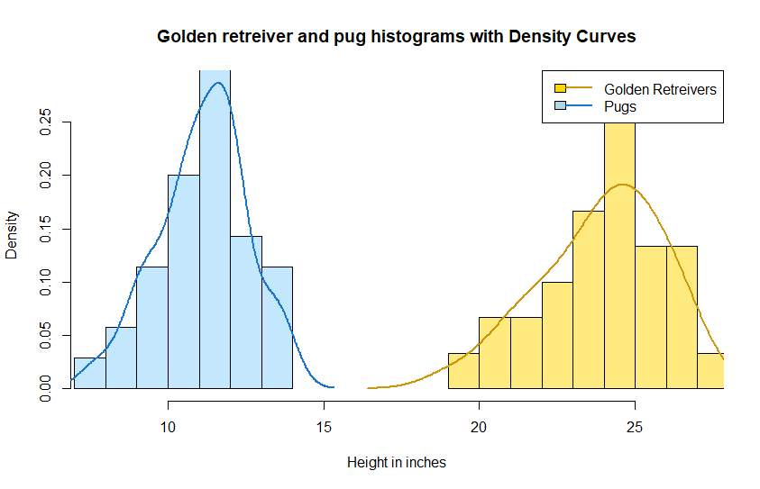
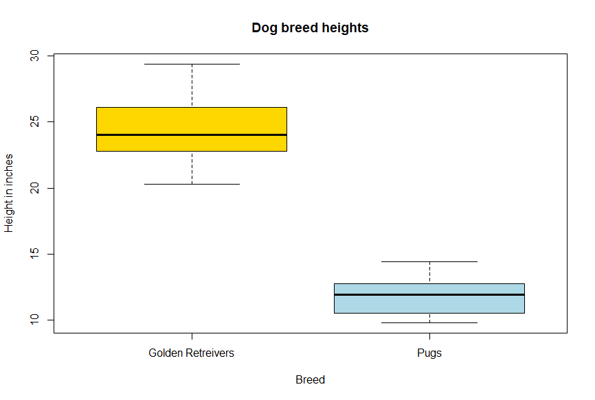
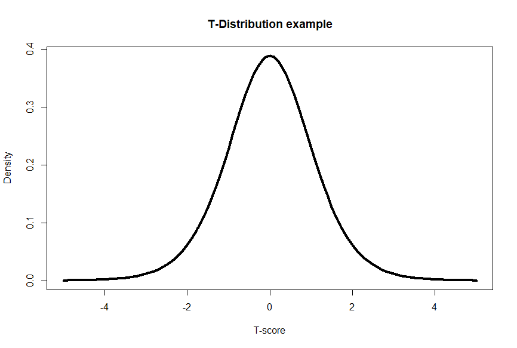

# Things might be different now
## 7. Comparing 2 groups (t-tests)

Finally! We’ve arrived at comparing a specific variable between two groups- we will compare heights between golden retrievers and pugs. The statistical test we will use to do this is called a t-test. Like other statistical tests, t-tests are a statistical tool that can help us compare data and determine if there are any significant differences. Below we can see what our samples look like with a height histogram of golden retreievers and pugs.  
  

  
 
T-tests are specifically designed to analyze the means of two groups and determine if they are significantly different from each other. Like we’ve talked about many times (or too many?), we will focus on the average heights of golden retrievers and pugs. Like any statistical test, we need to check the types of variables being compared are appropriate for the test and that other requirements of the test, or assumptions, are met to properly analyze our comparison of interest. T-tests are used for comparing a continuous variable (height) between a categorical variable with 2 possible values (dog breeds: 1.golden retrievers vs 2. pugs).  
 
This might not mean much at this point, but the figure below, known as a box and whiskers plot (often just called a box plot), can help show how two groups look like they could possible vary. Box plots show the ranges of a contunuous variable by a categorical variable. The main box filled with color indicates the two 25% quarters of the data around the median value for a group, with the "whiskers" indicating the other two 25% groups further from the median. The box plot indicates that golden retreivers in the gold color do have a median height around 24 inches, while pugs have a median height around 12. We might have an educated guess that golden retreier and pug heights are different, but a t-test would give us a much stronger validation in supporting our hypothesis that golden retreiver and pug heights differ.  
 

  
 
To perform a t-test, we make several assumptions and should make sure the assumptions are met. These include having independent samples, approximately normally distributed data, and homogeneity of variances between the two groups. These are some fancy sounding words- we’ll break them down. Independent samples mean that there is no relationship between the groups we are comparing, ie, we are not collecting the data points of each dog twice and the height of a pug does not affect the height of a golden retriever. We’ve seen normally distributed data before, and this assumption of needing normally distributed data means that the heights within each group should follow a bell-shaped curve. Homogeneity of variances implies that the variability in heights should be similar between the two groups. This means that pugs should vary in height similarly to golden retriever height. There should not be pugs that are 2 to 50 inches tall while golden retrievers vary from 20-28 inches tall. We also need to know
our **degrees of freedom**, which is how many important parameters are varying (and are specific to each statistical test). T-tests have degrees of freedom equal to the sample size minus 1.  
 
Another thing to consider (though not a formal assumption) is our sample size. The sample size is crucial, as it affects the reliability of our results. The larger the sample size, the more accurate our conclusions will be, but the larger the sample size could be costly For simplicity, let's say we measure the heights of 30 golden retrievers and 30 pugs (a total sample size of 60, or shorthard n=60). This also means our degrees of freedom is 59 (t-test degrees of freedom = n -1).  
  
<iframe width="560" height="315" src="https://www.youtube.com/embed/Uyd_Fk9cDjA" frameborder="0" allowfullscreen></iframe> 
  
Next, we calculate the average (mean) height for each group. Let's assume (from the American Kennel Club)  the average height of the Golden Retrievers is 24 inches with a standard deviation of ∓ 2 inches, while the average height of the Pugs is 11.5 inches ∓ 1.5 inches. Now comes the exciting part - the one you’ve been waiting for what seems like years- performing the t-test! We will use this test to determine if the difference in average heights between the two breeds is statistically significant (meaning we are more certain than not that the differences are not due to chance).  
 
The t-test generates a test statistic, the t-value, which indicates the magnitude of the difference between the two groups. Additionally, the t-value corresponds to a p-value. The p-value represents the probability of obtaining the observed mean heights between groups. If the t-value is far enough away from 0 (both positive and negative t-values could indicate significance), we would obatin a small p-value, and then reject the null hypothesis. This would suggesting there is a difference in heights between golden retrievers and pugs. We can see that t-scores that are further away from zero are rarer (less dense on y-axis), and thus correspond with a lower p-value   
 

  

[_For more in depth T-score formula and calculations, check out this Khan Academy Video_](https://www.khanacademy.org/math/statistics-probability/significance-tests-confidence-intervals-two-samples/comparing-two-means/v/difference-of-sample-means-distribution)  
 
In our example, let's say the t-value is 5.2 and our degrees of freedom (or df) are 59. Using a t-test table or statistical software, we find the corresponding p-value is < 0.001. This would be a t-test on the far right of the t distribution above. The t-test suggests there is a difference between the heights of Golden Retrievers and Pugs. The p-value < 0.001 suggests that there is less than a 0.1% chance of observing such a difference by random chance alone. Based on the p-value of < 0.001 being smaller than the critical threshold of 0.05, we reject the null hypothesis that states there is no difference between heights of golden retrievers and pugs. Instead with a statistically significant p-value, we accept the alternative hypothesis- there is a difference in average heights between golden retrievers and pugs. We now have evidence that the groups differ and then by looking at the mean heights between groups, we can now say we have evidence to support our intuition of pugs being shorter than golden retrievers.  
 
[_For more in depth p-value and conversion to p-values, check out this video from Khan Academy_](https://www.khanacademy.org/math/statistics-probability/significance-tests-confidence-intervals-two-samples/comparing-two-means/v/hypothesis-test-for-difference-of-means)  
 
The t-test is a versatile tool that can be applied to various scenarios. It can be used to compare the effectiveness of two different medications, see resource investments between neighborhoods, or analyze if there are any disparities in plant growth between two applied fertilizers. Of course, the world is not full of variables split evenly in two groups. There will be plenty of applications of wanting to compare multiple groups to one another, like comparing golden retriever height to pug height and to St. Bernard height. T-Tests are not designed to do this, but another test, called an ANOVA, is perfect for this scenario! That’s why we will explore in the next lesson.  

| [Home](https://benrushscience.github.io/learning-data-science/) | [Next](https://benrushscience.github.io/learning-data-science/pages/8-comparing-2+-groups.html) |
