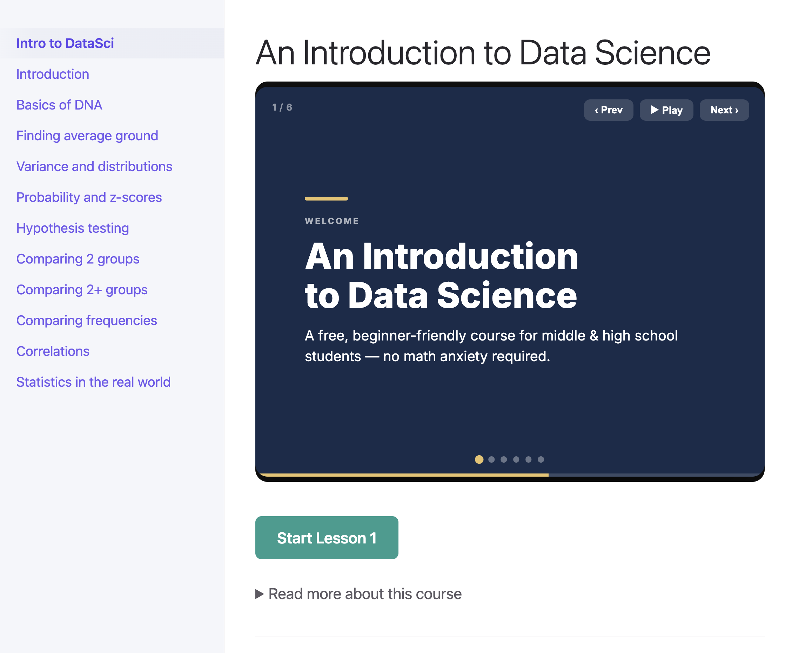
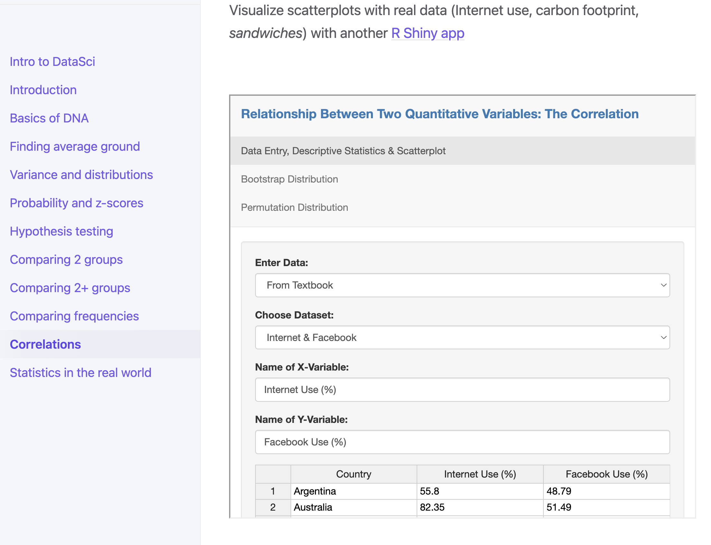

<!-- -Describe the submission, and explain its eligibility for JOSE.
-Include a “Statement of Need” section, explaining how the submitted artifacts contribute to computationally 
  enabled teaching and learning, and describing how they might be adopted by others.
-For software submissions, describe the functionality of the software, usage and recent experience of use
 in teaching and learning situations.
-For learning modules, describe the learning objectives, content, instructional design, and experience of 
  use in teaching and learning situations.
-Tell us the “story” of the project: how did it come to be?
-Cite key references, including a link to the open archive of the sofware or the learning module.
-JOSE welcomes submissions with diverse educational contexts. You should write your paper for a non-specialist reader. 
  Your submission should probably be around 1000 words (or around two pages).
- Create bibliography
- Name of software product (maybe PonderStats... ponderstats.wid.wisc.edu) -->

# Summary
We created a website on GitHub pages (_https://solislemuslab.github.io/learning-data-science/_) for containing introductory statistics learning materials accompanied by engaging media and R scripts for middle and high school students. The website and scripts are designed to mirror an introductory course to statistics and tie it to serveral realworld fields using statistics and data science. Similar to other education materials aimed at students in grade school [@thompson_data_2022], the website, starts with an introduction that middle school and high school students can grasp: the diversity of dog breeds.
We introduce the character of Rhonda, a tall female golden retriever. We lead readers through the thinking "how do we actually know Rhonda
is tall?". Next, readers read through comparisons of Rhonda to other golden retreivers based on personal observations, defining
a metric of "tallness", types of variables, comparing Rhonda to other golden retreivers, and eventually other comparing to
bog breeds. This approach helps lay the foundation for statistics and data science for students through self-paced exploration [@chittora_interactive_2020]. 
Students read through these concepts all while provided humorous examples and comments, links for further learning, RShiny Apps for readers to 
learn experientially, visuals, embedded videos, and the scripts for students to follow along. In sum, students have access to 11 different lessons to learn about introductory statistics and data science at their own pace.

# Statement of Need
In our experience, the introduction to statistics and data science rely heavily on the mathematical
formulas instead of the applications of these formulas and without a humanist perspective in student learning [@lee_call_2021]. In fact, the first author 
struggled in calculus because the applications to the real-world seemed extremely distant. He stopped taking
math classes until forced to take statistics to complete his undergraduate degree. Despite his hesitation,
he fell in love with statistics and absorbed all of the information possible. The authors hope that 
this website might be able to connect with and inspire younger learners to pursue the applied mathematics
fields of statistics and data science. The website and open scripts are aimed to be fun and engaging through a mix 
of media that focus on why these fields are important for individual decision making and
potential career paths. The option to delve further into the formulas in statstics are available, which can encourage learning [@lee_call_2021], but the
interpretations of statistical tests to real-world applications are prioritized. RShiny apps (Figure \ref{figwebapp}) and the code that
generated many of the figures are available for students to interact with. We believe this website and script can
serve to provide an intriguing first encounter with statistics and data scientists in a relevant way [@weiland_culturally_2023], especially for those students
who might be conditioned to be math averse. We also plan to expand the website to include more topics on data science
and machine learning, which seem possible to be introduced to younger students [@sanusi_developing_2023].

# Website description

The website provides an introduction to statistics and data science for middle school, high school, and undergraduate students. Each section begins with a AI-generated slideshow that highlights each topic in 60 seconds.
The writing and multiple media are designed to be engaging and fun while still covering the topics of an introductory statistics
course. The website is focused much more on the reasoning behind the statistics and data science than the mathematical formulas.
The website is hosted on GitHub pages and can be found at _https://solislemuslab.github.io/learning-data-science/_. The website is divided into 11 lessons, navigable to from the home page. 
Figure \ref{figmain} shows the welcome page of the website with the AI-generated slideshow and the menu of topics on the left. 

The lessons and learning objectives are:

1. [Introduction](https://solislemuslab.github.io/learning-data-science/lecture-notes/1-introduction.html): Why data science?
    - By the end of this lesson, students will be able to:
        * Identify why statistics is helpful in the real world for assessing differences and patterns
        * Describe the challenges of determining differences and patterns
        * Discuss a comparison model of genetic diversity (dogs) for reference when thinking through the following lessons
2. [Basics of DNA](https://solislemuslab.github.io/learning-data-science/lecture-notes/2-genetic-diversity.html):
    - By the end of this lesson, students will be able to:
        * Restate what genes and DNA are with analogies to cooking
        * Define genetic diversity, genetic variation, and gene expression
         Review core concepts in plants and animal genetic diversity
3. [Finding average ground](https://solislemuslab.github.io/learning-data-science/lecture-notes/3-averages-and-medians.html): Computing means and medians
    - By the end of this lesson, students will be able to:
        * Calculate the mean and median
        * Illustrate why the mean and median is useful when critically thinking about data
        * Describe and recognize how the median and mean can be skewed 
4. [Variance and distributions](https://solislemuslab.github.io/learning-data-science/lecture-notes/4-variance-and-distributions.html):
    - By the end of this lesson, students will be able to:
        * Restate how the mean is helpful but is aided by variance to critically think about data distribution and skew
        * Calculate and describe what standard deviation is for a sample
        * Explain what distributions are and why the normal distribution is used frequently
5. [Probability and z-scores](https://solislemuslab.github.io/learning-data-science/lecture-notes/5-probability-and-z-scores.html):
    - By the end of this lesson, students will be able to:
        * Discuss the basics of events happening in terms of probability
        * Describe how z-scores of a individual data point explain how common that data point is
        * Interpret how z-scores interact with distributions and how we obtain p-values from distribution and tables
6. [Hypothesis testing](https://solislemuslab.github.io/learning-data-science/lecture-notes/6-hypothesis-testing.html):
    - By the end of this lesson, students will be able to:
        * Describe and recognize a scientific hypothesis
        * Describe and form null and alternative hypotheses
        * Discuss how it’s impossible to know everything about all variables in space and time, so we reject the null hypothesis
7. [Comparing 2 groups](https://solislemuslab.github.io/learning-data-science/lecture-notes/7-comparing-2-groups.html):
    - By the end of this lesson, students will be able to:
        * Demonstratethe value of testing two groups statistically
        * Explain when and how to apply t-tests
        * Demonstrate how to and critique an interpretation of a t-test including:
            1. Test results
            2. T statistic
            3. How to reject the null hypothesis and its meaning
8. [Comparing 2+ groups](https://solislemuslab.github.io/learning-data-science/lecture-notes/8-comparing-2+-groups.html):
    - By the end of this lesson, students will be able to:
        * Discuss the value of testing multiple groups statistically
        * Explain when and how to apply ANOVA
        * Demonstrate how to and critique an interpretation of an ANOVA test including:
            1. Test results
            2. F statistic
            3. How to reject the null hypothesis, and that this means there is a global group difference, but can’t tell which groups are different
        * Define a post-hoc analysis and explain how a post-hoc analysis yields additional results about multiple group comparisons
9. [Comparing frequencies](https://solislemuslab.github.io/learning-data-science/lecture-notes/9-comparing-frequencies.html):
    - By the end of this lesson, students will be able to:
        * Discuss the value of testing frequencies statistically for both goodness of fit and tests of independence
        * Explain when and how to apply chi-squared tests
        * Demonstrate how to and critique an interpretation of Chi-Square test including:
            1. Test results
            2. Chi-square statistic
            3. How to reject the null hypothesis, and that this means there is a global group difference, but can’t tell which groups are different
10. [Correlations](https://solislemuslab.github.io/learning-data-science/lecture-notes/10-correlations.html):
    - By the end of this lesson, students will be able to:
        * Discuss the value of testing two continuous variables statistically
        * Explain the difference between correlation and causation
        * Demonstrate how to and critique an interpretation of Pearson correlation and multiple regression test including:
            1. How to interpret an r-value
            2. How to interpret the results of a multiple regression test
            3. How to reject the null hypothesis and understand that rejecting the null hypothesis for a correlational test still means no causation
11. [Statistics in the real world](https://solislemuslab.github.io/learning-data-science/lecture-notes/11-statistics-in-the-real-world.html): 
    - By the end of this lesson, students will be able to:
        * Discuss sample size and power
        * Identify when to use and the value of non-parametric tests
        * Describe effect size and why it is important in statistics
        * Underlines the importance and lengthy process of data cleaning
        * Illustrate real world applications of statistics that have been used to improve the world

Some of the examples are connected to a well-known learning resource: [WI Fast Plants](https://fastplants.org/) [@williams1986rapid]. Originally developed as a research tool at the University of Wisconsin-Madison, WI Fast Plants have been used by K-16 teachers around the world for nearly 30 years as an educational model-organism. [WI Fast Stats](https://wi-fast-stats.wid.wisc.edu/) [@Liu2022] is an integrated animated web page which serves as a medium to a collection of R-developed web apps that provide Data Visualization and Data Analysis tools for WI Fast Plants data, and this web page is illustrated within our website (Figure \ref{figfast}).

![Correlations topic which shows the embedded WI Fast Stats R shiny app [@Liu2022] for computing correlations out of WI Fast Plants data [@williams1986rapid].\label{figfast}](screenshot-fast-stat.png)

# Active Script Learning via PonderStats

We created an R script that accompanies the website. The script is designed to be used by students to follow along with the lessons so
they can create similar data and figures as those featured on the website. The script is sectioned according to the website lessons and
states what will be learned in each section. The script is designed to be used by students who have no prior experience with R. The script
can be found [here](https://github.com/solislemuslab/learning-data-science/blob/main/code/PonderStats_script.R).

# Acknowledgements

This work was supported by the National Science Foundation (DEB-2144367 to CSL).
We acknowledge feedback from Hedi Lauffer, Hailey Louw, Reed Nelson, Sungsik Kong, Mengze Tang, Evan Gorstein,
Xudong Tang, Yibo Kong, Nathan Kolbow, Yunju Ha, Tianyi Xu, and Rosa Aghdam.

# References